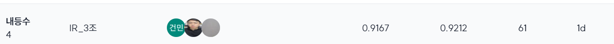

[](https://classroom.github.com/a/Tm6AYAOm)
# Title (Please modify the title)
## Team

|  |   |  |
| :--------------------------------------------------------------: | :--------------------------------------------------------------: | :--------------------------------------------------------------: |
|            [정인웅](https://github.com/Messengerwoong)             |            [이범희](https://github.com/tmttd)             |            [박건민](https://github.com/UpstageAILab)             |
|                          모든 역할 + gemini api 구현                             |                    모든 역할 + 프롬프트 엔지니어링                             |                       모든 역할 + 각종 알고리즘 구현                             |

[](https://classroom.github.com/a/FVjNDCrt)


## 0. Overview
### Environment
- Ubuntu 20.04.6 LTS
- GPU: RTX 3090 / 24 GB
- Memory: 60G

### Requirements
```python
sentence_transformers==2.2.2
elasticsearch==8.15.2
openai==1.7.2
```

## 1. Competiton Info

### Overview
- Scientific Knowledge Question Answering | 과학 지식 질의 응답 시스템 구축(https://stages.ai/competitions/322/overview/description)

RAG 시스템이 사용자 질문에 적합한 레퍼런스를 찾고 이를 토대로 답을 잘하는 지 보는 목적

- `#비공개대회` `#UpstageAILab3기` `#information Retrieval`

### Timeline

- 10 2, 2024 - Start Date
- 10 24, 2024 - Final submission deadline

## 2. Components

### Directory

## 3. Data descrption

### Dataset overview

> **document.jsonl**
{"docid": "42508ee0-c543-4338-878e-d98c6babee66", "src": "ko_mmlu__nutrition__test", "content": "건강한 사람이 에너지 균형을 평형 상태로 유지하는 것은 중요합니다. 에너지 균형은 에너지 섭취와 에너지 소비의 수학적 동등성을 의미합니다. 일반적으로 건강한 사람은 1-2주의 기간 동안 에너지 균형을 달성합니다. 이 기간 동안에는 올바른 식단과 적절한 운동을 통해 에너지 섭취와 에너지 소비를 조절해야 합니다. 식단은 영양가 있는 식품을 포함하고, 적절한 칼로리를 섭취해야 합니다. 또한, 운동은 에너지 소비를 촉진시키고 근육을 강화시킵니다. 이렇게 에너지 균형을 유지하면 건강을 유지하고 비만이나 영양 실조와 같은 문제를 예방할 수 있습니다. 따라서 건강한 사람은 에너지 균형을 평형 상태로 유지하는 것이 중요하며, 이를 위해 1-2주의 기간 동안 식단과 운동을 조절해야 합니다."}
{"docid": "4a437e7f-16c1-4c62-96b9-f173d44f4339", "src": "ko_mmlu__conceptual_physics__test", "content": "수소, 산소, 질소 가스의 혼합물에서 평균 속도가 가장 빠른 분자는 수소입니다. 수소 분자는 가장 가볍고 작은 원자로 구성되어 있기 때문에 다른 분자들보다 더 빠르게 움직입니다. 이러한 이유로 수소 분자는 주어진 온도에서 가장 빠른 평균 속도를 가지고 있습니다. 수소 분자는 화학 반응에서도 활발하게 참여하며, 수소 연료로도 널리 사용됩니다. 따라서 수소 분자는 주어진 온도에서 평균 속도가 가장 빠른 분자입니다."}
> 
> **eval.jsonl**
{"eval_id": 78, "msg": [{"role": "user", "content": "나무의 분류에 대해 조사해 보기 위한 방법은?"}]}
{"eval_id": 213, "msg": [{"role": "user", "content": "각 나라에서의 공교육 지출 현황에 대해 알려줘."}]}

## 4. Modeling

### Model descrition
- chatgpt 3.5 turbo, chatgpt 4o
- gemini-pro 1.5, gemini-flash 1.5

### Modeling Process

- LLM모델을 사용하여 RAG기능 비교

## 5. Result
MAP	MRR
### Leader Board
> PUBLIC <br>


> PRIVATE <br>


> BEST SCORE <br>

### Presentation

- [💾 PDF](./[패스트캠퍼스] Upstage AI Lab 3기_IR 경진대회_발표자료_3조.pdf)

## etc
### Reference
- [baseline code](https://stages.ai/competitions/322/data/baseline)

